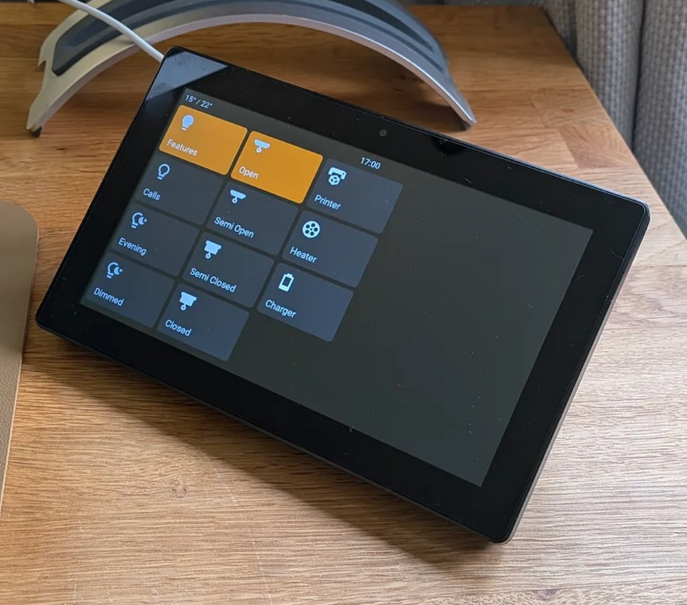

# Espcontrol

Turn a 7-inch touchscreen into a control panel for your smart home. Espcontrol is free, open-source firmware for the **Guition ESP32-P4 JC1060P470** display that connects to [Home Assistant](https://www.home-assistant.io/) and lets you control up to 20 devices with a single tap.

**Documentation and install guide:** [jtenniswood.github.io/espcontrol](https://jtenniswood.github.io/espcontrol/)

## Features

- **Up to 20 buttons** — control lights, switches, fans, locks, covers, media players, and more
- **Drag-and-drop layout** — rearrange buttons from your browser
- **Automatic icons** — the panel picks an icon based on the device type, or choose from hundreds of icons manually
- **Custom labels** — name each button however you like, or let it use the name from Home Assistant
- **Colour themes** — set the on and off colours for your buttons
- **Temperature display** — show indoor and outdoor temperatures in the top bar
- **Live clock** — always visible, synced from Home Assistant
- **Screensaver** — dims and sleeps after a configurable idle time, with an optional motion sensor to wake it
- **Day and night brightness** — the screen adjusts brightness automatically based on sunrise and sunset
- **Over-the-air updates** — new firmware versions are installed automatically (or manually, your choice)
- **Easy WiFi setup** — if the panel can't connect, it creates its own hotspot so you can enter your WiFi details
- **No coding required** — everything is configured through a built-in web page after the first install

## Getting started

1. **Buy the panel** (see below)
2. **Flash the firmware** from your browser — follow the [install guide](https://jtenniswood.github.io/espcontrol/install)
3. **Connect to WiFi** using the on-screen setup
4. **Add to Home Assistant** — it will be discovered automatically
5. **Configure your buttons** by opening the panel's web page

## Where to buy

- **Panel:** [AliExpress](https://s.click.aliexpress.com/e/_c335W0r5) (~£40)
- **Desk stand** (3D printable): [MakerWorld](https://makerworld.com/en/models/2387421-guition-esp32p4-jc1060p470-7inch-screen-desk-mount#profileId-2614995)

## Links

- [Documentation](https://jtenniswood.github.io/espcontrol/)
- [Install guide](https://jtenniswood.github.io/espcontrol/install)
- [Report a bug or request a feature](https://github.com/jtenniswood/espcontrol/issues)
